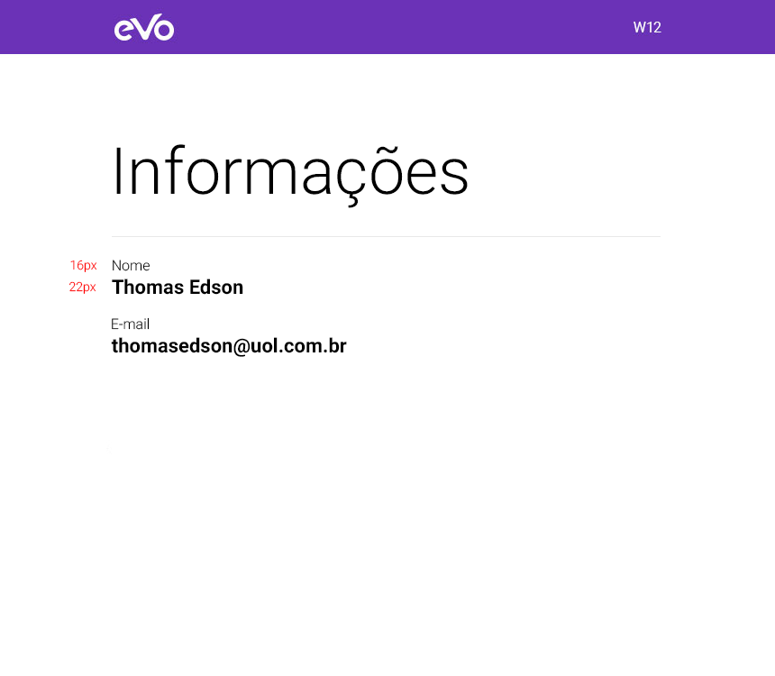

# Teste Vaga Front-end
Este é um repositório para teste para vaga de front-end na W12

Desenvolver o frontend conforme imagem proposta no projeto.

**Requisitos**:
- Estruturar utilizando Angular como framework (preferencialmente acima da 2ª versão)
- Criar html da página
- Criar css em arquivo externo (não utilizando inline). Os inputs de texto e botão devem ter a aparência conforme o guia de estilo abaixo
- Aplicar javascript de validação de e-mail
- Fazer a persistência dos dados no localStorage
- Após salvar exibir em uma nova página os dados salvos em localStorage

**Observações**

O logo do projeto está dentro do diretório "images" com o nome logo-evo.svg

### 1. Pagina de cadastro

### 2. Pagina com as informações

